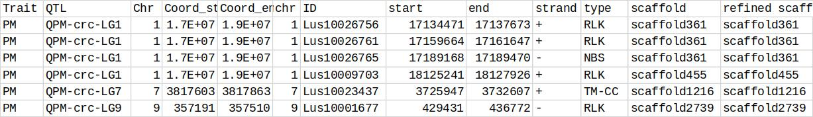
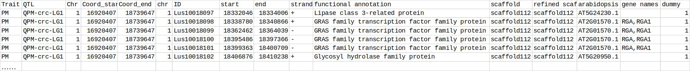

# A User Guide for Mapping QTL onto the Most Recent Release of the Chromosome-scale Pseudomolecules in Flax

*Frank M. You and Sylvie Cloutier*

*Ottawa Research and Development Centre, Agriculture and Agri-Food Canada, Ottawa, ON K1A 0C6, Canada*


This user guide provides a brief description of the methods with their
software tools and database files for mapping QTL onto the most recent
release of the chromosome-scale pseudomolecules in flax (You et al.
2018).

In the supplementary files, there is a folder named "program\_packages"
that contains four Perl scripts (Program\_S\[1-4\]\_\*.pl), a user guide
document (UserGuide_S1.pdf), and two subfolders "sample\_data" and
"database\_files". Please copy all scripts and files in the two
subfolders to a working folder.

## 1.  Reference sequences

The most recent release of the flax pseudomolecules (You et al. 2016)
includes 15 sequences corresponding to 15 flax chromosomes. Their
accession numbers in NCBI and sequence lengths are listed in the
following table:

Sequences of 15 chromosomes in the NCBI database.

 | Chromosome  | NCBI accession   | Length of sequence (bp) |
 | ----------- | ---------------- | ----------------------- |
 | Lu1         | CP027619         | 29,425,369	            |
 | Lu2         | CP027626         | 25,730,386              |
 | Lu3         | CP027627         | 26,636,119 |
 | Lu4         | CP027628         | 19,927,942 |
 | Lu5         | CP027629         | 17,699,757 |
 | Lu6         | CP027630         | 18,078,158 |
 | Lu7         | CP027631         | 18,299,719 |
 | Lu8         | CP027632         | 23,785,339 |
 | Lu9         | CP027633         | 22,091,576 |
 | Lu10        | CP027620         | 18,203,127 |
 | Lu11        | CP027621         | 19,887,771 |
 | Lu12        | CP027622         | 20,889,232 |
 | Lu13        | CP027623         | 20,483,506 |
 | Lu14        | CP027624         | 19,392,306 |
 | Lu15        | CP027625         | 15,636,771 |
 | Total       |                  | 316,167,078 |
 

These sequences can be downloaded directly from the NCBI nucleotide
databases by searching individual accession number, for example, at
*https://www.ncbi.nlm.nih.gov/nuccore/CP027619*, 
or by using NCBI Batch Entrez for batch download at
*https://www.ncbi.nlm.nih.gov/sites/batchentrez*.
All sequences can be saved in a fasta file.

If you only need to convert coordinates of SNPs from the scaffolds based
reference sequences onto the most recent release of the chromosome-scale
pseudomolecules, you do not need to download these sequence. These
sequences are required only when you map PCR based markers to the flax
pseudomolecules.

## 2.  Mapping PCR based markers to the most recent release of the chromosome-scale pseudomolecules

The electronic PCR (e-PCR) method is used to map paired PCR primers onto
the flax pseudomolecules (Schuler, 1997). The source code for the e-PCR
program is freely available
(*ftp://ncbi.nlm.nih.gov/pub/schuler/e-PCR/*).

Two executive programs, "fahash" and "re-PCR", are included in the e-PCR
program package. You need to download the source code to compile it and
then place two executable files into the same working directory. The two
executable programs can be also saved in any other folder but a path
pointing to them must be correctly set so that the Perl scripts can
access them.

**Step 1.** Create a search database

Usage:

```
perl ProgramS1_prepare_rePCR_data.pl
  -i fasta file name of the reference sequence (* is allowed)
  -s genome name as file name prefix
  -m maximum number of sequences for each database (Default:5000)
```

Default parameters for the "fahash" program are used in the
ProgramS1\_prepare\_rePCR\_data.pl script:

```
$cmd = "fahash -b $genome_hash -w 12 -f3 $genome_map";
```

Two output files "\*.famap" and "\*.hash" will be generated in this
step.

**Step 2**. Mapping PCR markers to the reference genome

Usage:

```
perl ProgramS2_rePCR_pipeline.pl
-p primer file (required)
-d reference genome hash file (required, generated from
   ProgramS1_prepare_rePCR_data.pl, both *.famap and *.hash must be available)
-m number of mismatches (default: 0)
-g number of gaps (default: 0)
```

**Example:**

**Step 1:**

Flax pseudomolecule sequences are saved in a file in fasta format, e.g.,
**flax\_pseudomolecules.fasta**

```
perl ProgramS1_prepare_rePCR_data.pl -i flax_pseudomolecules.fasta
-s flax_new_pseudo
```

Two output files will be generated in this step:  
flax\_new\_pseudo\_1.famap  
flax\_new\_pseudo\_1.hash  

**Step 2:**

```
perl ProgramS2_rePCR_pipeline.pl 
  -p program_S2_sample_marker_data.txt 
  -d flax_new_pseudo_1.hash
```

A sample marker file "program\_S2\_sample\_marker\_data.txt" is included
in the program package. This file contains a header line with four
columns separated by a tab key (\\t). The last column is the amplicon
size range of the PCR marker. It must have the following format:

```
  Primer ID	Forward Primer	           Reverse Primer	 Size range
  Lu2164     GCATGATCGTTACTTTAGGATGC    AATGACGCCATCTTTTGTCC       50-1500 
  Lu2183     CTTCATGCAGTCCGTTTTTACA     CAGTTCGTAGTTTACTTGGTGCAG   50-1500 
  Lu2532     GGATAGAAGCTCACCGATGC       TTCAGAGCACCAGCAGAAAA       50-1500 
  Lu2545     TGCTTTGCTAATTTATTATGGTGAG  ATGGTAGCTGGTGGGTGAAC       50-1500 
  Lu2555     TCCCGCTTTTAATGGTGTTC       AATTGGAAGCTCGATTCACG       50-1500 
  Lu2560     CGTGGCTACTAGCAATGTGG       TCCTCATGTTCATTGCTTGC       50-1500 
  Lu2564     TTTCAGCTTCGATTGAGACG       ATCCGTCGAGGTAACAGTCC       50-1500 
```

The "flax\_new\_pseudo\_1.hash" and "flax\_new\_pseudo\_1.famap"
generated from Step 1 must be in the same working directory.

An output file
"program\_S2\_sample\_marker\_data.txt\_primer\_rePCR\_results.txt" will
be generated: 

```
 #-sts	seq   strand   from	  to	   mism	  gaps	act_len/exp_len
 Lu2164	1      -      22948222   22948580   0      0      359/50-1500 
 Lu2183	1      -      26435050   26435329   0      0      280/50-1500 
 Lu2555	6      +      14948801   14948986   0      0      186/50-1500 
 Lu2560	6      -      13553559   13553779   0      0      221/50-1500 
 Lu2564	6      -      13620999   13621234   0      0      236/50-1500 
 Lu2532	7      -      661757     662020     0      0      264/50-1500 
 #-
 Done
```

## 3.  Mapping SNPs on scaffold reference sequences to the most recent release of the chromosome-scale pseudomolecules

Usage:

```
perl ProgramS3_convert_scaffold_coordinates_to_pseudochr.pl
  -m scaffold to pseudomolecule mapping file. Table S4 must be used.
  -d scaffold coordinate data file which must have three column: marker
     name, scaffold IDs and coordinates
```

The "program\_S3\_sample\_marker\_data.txt" is a sample marker data file
that must contain three columns separated by a tab key (\\t):

```
  Marker                 Scaffold ID    Coordinate_on_scaffold
  scaffold112_114241    scaffold112    114241
  scaffold1491_318496   scaffold1491   318496
  scaffold31_1800846    scaffold31     1800846
  scaffold344_309662    scaffold344    309662
  scaffold51_1349321    scaffold51     1349321
  scaffold59_572553     scaffold59     572553
  scaffold156_641874    scaffold156    641874
  scaffold147_367986    scaffold147    367986
  scaffold859_123972    scaffold859    123972
  scaffold297_275113    scaffold297    275113
  scaffold361_14957     scaffold361    14957
  scaffold273_68457     scaffold273    68457
```

The
"TableS4\_flax\_scaffolds\_corrdinates\_in\_new\_pseudomolecules.txt" is
a database file that contains accurate information for mapping scaffold
sequences to the pseudomolecules. This file is provided in the program
package.

**Example:**

```
perl ProgramS3_convert_scaffold_coordinates_to_pseudochr.pl 
  -m TableS4_flax_scaffolds_corrdinates_in_new_pseudomolecules.txt 
  -d program_S3_sample_marker_data.txt
```

A "program\_S3\_sample\_marker\_data.txt.converted.txt" will be
generated:

```
Marker               Scaffold ID    Coordinate_on_scaffold  Chr  New_Chr_Coord
scaffold112_114241   scaffold112    114241                  1     18444086
scaffold1491_318496  scaffold1491   318496                  6     14006651
scaffold31_1800846   scaffold31     1800846                 3     3929932
scaffold344_309662   scaffold344    309662                  1     11008279
scaffold51_1349321   scaffold51     1349321                 4     10532424
scaffold59_572553    scaffold59     572553                  1     10051709
scaffold156_641874   scaffold156    641874                  3     5906791
scaffold147_367986   scaffold147    367986                  5     11288517
scaffold859_123972   scaffold859    123972                  15    1939372
scaffold297_275113   scaffold297    275113                  1     16435852
scaffold361_14957    scaffold361    14957                   1     16726904
scaffold273_68457    scaffold273    68457                   8     585113
```

The last two columns are the converted results, including chromosome
numbers and new coordinates on chromosomes.


## 4.  Candidate Gene Scanning of QTL

Usage:

```
perl ProgramS4_flax_QTL_candidate_gene_scanning.pl
  -q QTL file
  -d gene annotation file
  -w upstream or downstream window size (bp) (default: 100000 bp)
```

A sample data file for QTL data "program\_S4\_sample\_qtl\_data.txt" is
provided in the program package. This file must have four columns
separated by a tab key (\\t):

```
Trait    QTL           Chr    Coord_start    Coord_end
PM       QPM-crc-LG1	1     16920407        18739647
PM       QPM-crc-LG7    7     3817603         3817863
PM       QPM-crc-LG9    9     357191          357510
```

The gene annotation files "TableS6\_flax\_RGA\_coords.txt" and
"TableS5\_flax\_all\_genes\_coords.txt" are two database files that
contain coordinates of all resistance gene analogs (RGAs) or all protein
coding genes on the pseudomolecules and their functional annotation
information. Each of them can be used for a different purpose (scanning
RGAs or all genes). These two files are provided in the program package.

The upstream or downstream window size of the QTL position can be
specified. The default value is 100000 bp (i.e. 100 kb). That means that
all genes/RGAs within a total of 200 kb window of both upstream and
downstream of a QTL on a chromosome will be scanned. You can input a
different value for the window size.

**Example 1: scan resistance gene analogs within a 200 kb window covering upstream and downstream of the QTL position (default)**

```
perl ProgramS4_flax_QTL_candidate_gene_scanning.pl 
  -q program_S4_sample_qtl_data.txt 
  -d TableS6_flax_RGA_coords.txt
```

A result file
"program\_S4\_sample\_qtl\_data.txt\_gene\_annotations.txt" will be
generated in the following format:




**Example 2: scan all protein coding genes within a 200 kb window covering upstream and downstream of the QTL position (default)**

```
perl ProgramS4_flax_QTL_candidate_gene_scanning.pl 
  -q program_S4_sample_qtl_data.txt 
  -d TableS5_flax_all_genes_coords.txt
```

A result file with the same file name
"program\_S4\_sample\_qtl\_data.txt\_gene\_annotations.txt" will be
generated in the following format that slightly different from Example 1
(only part of results are shown):



**References**

You, F.M.; Xiao, J.; Li, P.; Yao, Z.; Jia, G.; He, L.; Zhu, T.; Luo,
M.-C.; Wang, X.; Deyholos, M.K.*, et al.* Chromosome-scale
pseudomolecules refined by optical, physical, and genetic maps in flax.
*Plant J.* **2018,** 95, (2), 371-384.

Schuler, G.D. Sequence mapping by electronic PCR. *Genome Res.*
**1997,** 7, (5), 541-550.
